# 📱 Carrinho Cheio

Aplicativo mobile desenvolvido em Flutter para criação e gerenciamento de listas de compras. Permite autenticação de usuários, criação de listas, adição e remoção de produtos, marcação de itens comprados e persistência via API REST.

API utilizada:
[https://listadella.azurewebsites.net/apiListadella_desafio.yaml/swagger/index.html](https://listadella.azurewebsites.net/apiListadella_desafio.yaml/swagger/index.html)

---

# 📚 Sumário

- [📸 Screenshots](#-screenshots)
- [🧠 Arquitetura do projeto](#-arquitetura-do-projeto)
- [🧩 Injeção de dependências](#-injeção-de-dependências)
- [🎨 Abordagem de Front-end](#-abordagem-de-front-end)
- [🌐 API](#-api)
- [🚀 Como executar o projeto](#-como-executar-o-projeto)
- [🚧 Melhorias possíveis](#-melhorias-possíveis)
- [📌 Observações](#-observações)

---

# 📸 Screenshots

## 🔐 Login e Home

<div style="display: flex; gap: 12px;">
  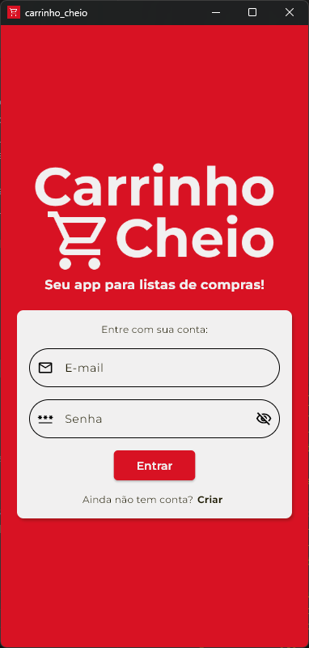
  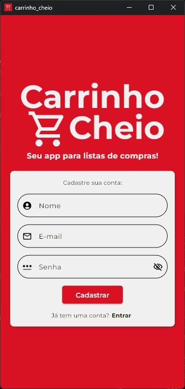
  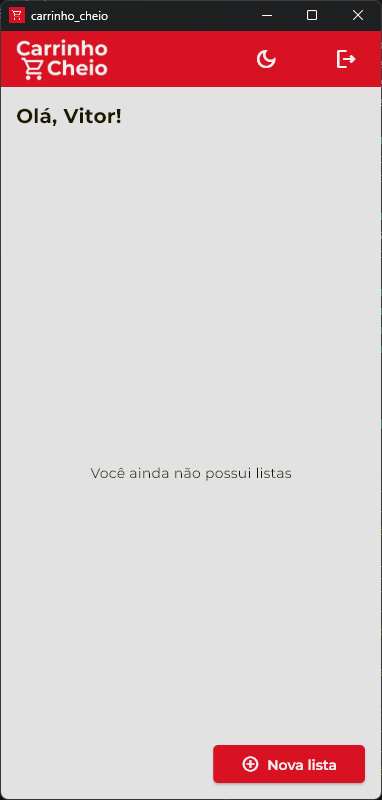
  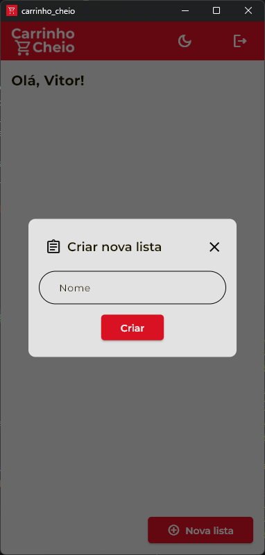
  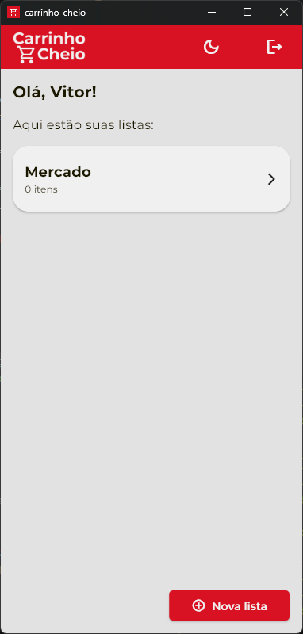
</div>

## 📋 Listas

<div style="display: flex; gap: 12px;">
  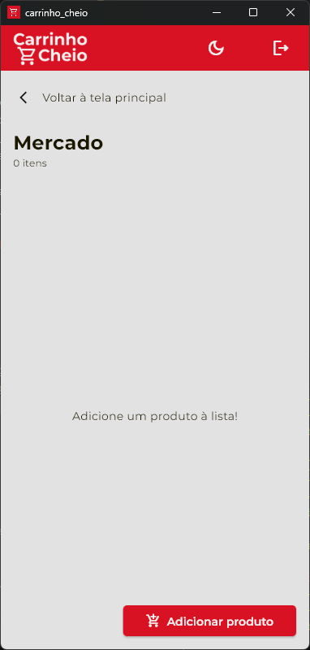
  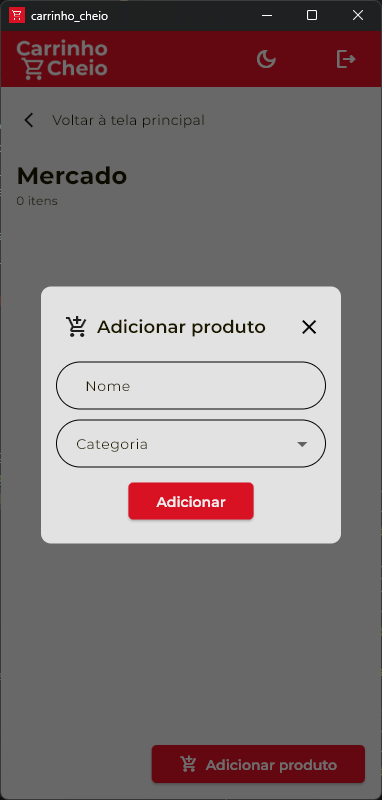
  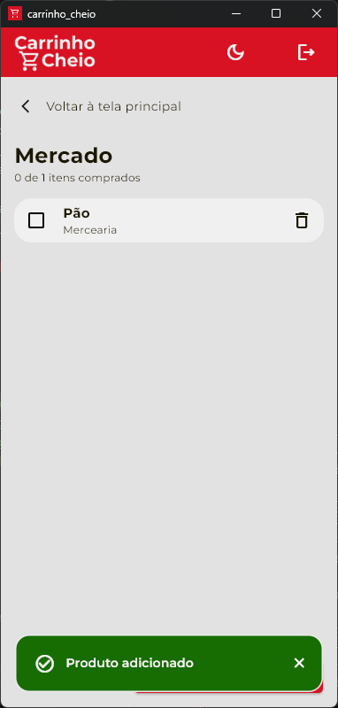
  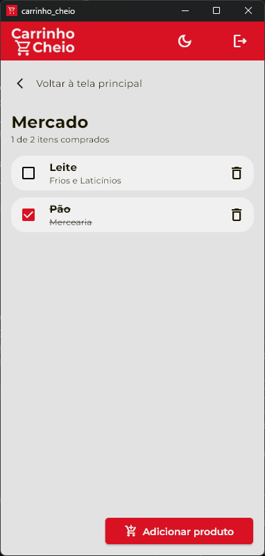
</div>

## 🌙 Dark Mode

<div style="display: flex; gap: 12px;">
  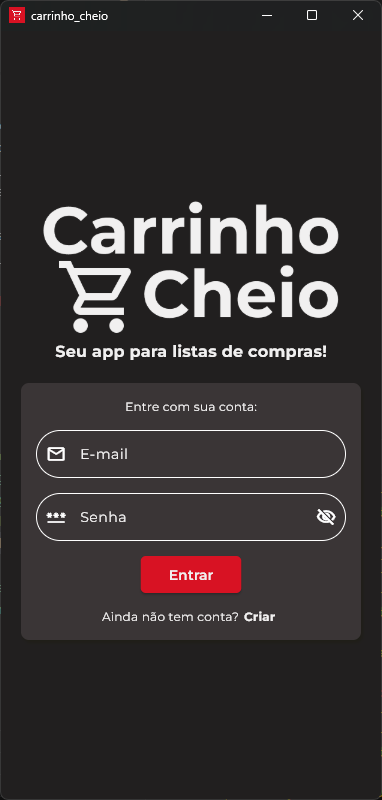
  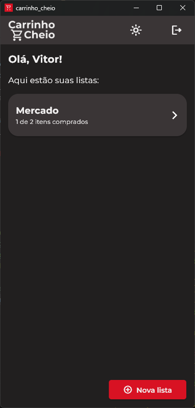
  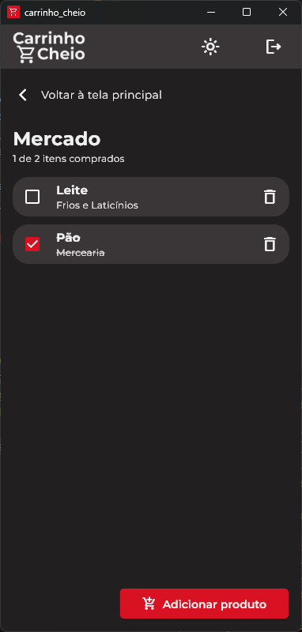
</div>

---

# 🧠 Arquitetura do projeto

O projeto segue uma arquitetura **feature-first + Clean Architecture simplificada**, separando responsabilidades em camadas:

- Presentation (UI + BLoC)
- Domain (Entities + Repositories abstratos)
- Data (Repositories implementados + DataSources)
- External (API / HTTP client)

---

## 🔄 Fluxo de dados

```
UI (Widgets)
   ⬇️
BLoC (State Management)
   ⬇️
Repository (Abstração de dados)
   ⬇️
Data Source (Implementação da API)
   ⬇️
REST API
```

---

## 🧱 Camadas do projeto

### 📌 Presentation

- Widgets reutilizáveis
- Páginas
- BLoCs (gerenciamento de estado)
- Estados e eventos

Responsável por:

- Interação com usuário
- Exibição de estados (loading, error, success)
- Disparo de eventos para o BLoC

---

### 📌 Domain

- Entities (modelos de negócio)
- Contracts de Repository

Responsável por:

- Regras de negócio da aplicação
- Definição de contratos independentes de implementação

---

### 📌 Data

- Models (DTOs)
- Implementação dos repositories
- Data sources (API calls)

Responsável por:

- Conversão de JSON ↔ Models
- Comunicação com API externa

---

# 🧩 Injeção de dependências

O projeto utiliza **GetIt** para injeção de dependências.

Ele é responsável por:

- Registrar repositories, datasources e services
- Fornecer instâncias globais desacopladas

Exemplo de uso:

```dart
final authRepository = getIt<AuthRepository>();
```

---

# 🎨 Abordagem de Front-end

## 🖼️ Design da interface

Foi criado um [protótipo no Figma](https://www.figma.com/design/nt6gowvqTt5GPyUUuSDWYL/Carrinho-Cheio?node-id=0-1&t=UvlobzF1IUrlkprK-1), inspirado em interfaces de supermercados com predominância de tons vermelhos. Também foi desenvolvido um **modo dark**.

---

## 🧩 Componentização

- Componentes reutilizáveis (ex: `CustomTextField`, `CustomElevatedButton`, `Toast`, `GenericDialog`)
- Base de páginas genéricas (ex: `AuthBasePage`)
- Redução de duplicação de código
- Padronização visual e comportamental

---

## 🔔 Feedback visual (UX)

O app utiliza feedback baseado no estado da aplicação:

- Success → Toast de sucesso
- Error → Toast de erro
- Loading → bloqueio de ações e indicadores visuais
- Empty State → mensagens informativas quando não há dados

---

## ⚙️ Gerenciamento de estado

- BLoC (flutter_bloc)
- Estados reativos

---

# 🌐 API

Integração com API REST para persistência de dados:

- Autenticação de usuários
- Listas de compras
- Produtos

---

# 🚀 Como executar o projeto

## 📦 Pré-requisitos

- Flutter SDK instalado
- Dart configurado
- Emulador ou dispositivo físico
- Versão utilizada - Flutter 3.44.0

---

## ⚙️ Configuração do ambiente

Crie o arquivo `.env` baseado no `.env.example`:

```bash
cp .env.example .env
```

Preencha as variáveis necessárias (ex: URL da API, Auth URL, etc).

---

## ▶️ Executar o projeto

```bash
flutter pub get
flutter run
```

---

## 🖥️ Suporte a Desktop

O projeto também suporta execução em:

- Windows 💻

### Pré-requisitos:

- Visual Studio com pacote de desenvolvimento para aplicações desktop

Executar no Windows:

```bash
flutter run -d windows
```

---

# 🚧 Melhorias possíveis

## 🔐 Autenticação (Token)

- O token possui expiração de 1 hora
- Como o projeto tem proposta simples, não foi implementado um sistema de refresh token ou validação automática de expiração

---

## 🌐 Conectividade

- Não há verificação contínua de conexão com internet
- Em melhorias futuras, seria interessante:
  - detectar ausência de conexão antes das requests
  - exibir estado offline na interface
  - bloquear ações que dependem da API quando offline

---

## 🎨 Design / UI

- O design foi baseado em um protótipo no Figma
- Algumas telas foram adaptadas durante o desenvolvimento por limitações técnicas e decisões de UX
- Melhorias futuras:
  - maior fidelidade pixel-perfect ao protótipo
  - adição de animações entre estados

# 📌 Observações

O endpoint LogInUsuario retorna UsuarioNome vazio em alguns cenários (ex: apenas primeiro nome, sem espaço e sobrenome)
